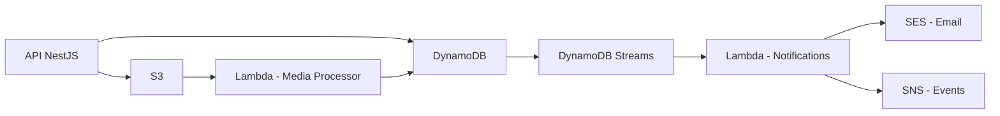

<div align="center">

# 🛍️ Service Marketplace API

### *Uma plataforma escalável e moderna para conectar clientes e prestadores de serviços*

[](https://nestjs.com/)
[](https://www.typescriptlang.org/)
[](https://aws.amazon.com/)
[](https://aws.amazon.com/dynamodb/)
[](https://www.docker.com/)

</div>

---

## 📋 Sobre o Projeto

**Service Marketplace** é uma API REST robusta que simula um marketplace de serviços, onde **clientes** criam solicitações e **prestadores** enviam propostas competitivas. O projeto demonstra práticas avançadas de arquitetura de software, integrando serviços AWS para processamento assíncrono, notificações em tempo real e armazenamento de mídia.

### ✨ Destaques

- 🏗️ **Clean Architecture** com separação clara de responsabilidades
- 🎯 **Princípios SOLID** aplicados rigorosamente
- ☁️ **Arquitetura Serverless** com AWS Lambda
- 📨 **Processamento Assíncrono** via DynamoDB Streams
- 📦 **Upload Direto ao S3** com Signed URLs
- 🔔 **Sistema de Notificações** multi-canal (Email + SNS)
- 🐳 **LocalStack** para desenvolvimento local

---

## 🏛️ Arquitetura

### Stack Tecnológica

<div align="center">

| Backend | Database | Cloud Services | DevOps |
|:-------:|:--------:|:--------------:|:------:|
|  |  |  |  |
| NestJS | DynamoDB | AWS Lambda | Docker |
|  |  |  |  |
| TypeScript | Streams | Amazon S3 | Node.js |

</div>

### Serviços AWS Integrados



---

## 🧩 Módulos da Aplicação

### 🔐 **Auth Module**
Autenticação e autorização com JWT
- Login/Register
- Refresh Token
- Validação de usuários

### 👥 **Users Module**
Gerenciamento de usuários
- Criação de contas (CLIENT/PROVIDER)
- Atualização de perfis
- Diferenciação de tipos de usuário

### 🛠️ **Services Module**
Catálogo de serviços
- CRUD de serviços disponíveis
- Categorização
- Associação com solicitações

### 📝 **Requests Module**
Solicitações de clientes
- Criar requests
- Status tracking (OPEN → IN_NEGOTIATION → CLOSED)
- Query via GSI (Global Secondary Index)

### 💼 **Proposals Module**
Propostas de prestadores
- Criar e listar propostas
- Atualização de status
- **Trigger de eventos** para processamento assíncrono

### 📧 **Notifications Module** *(Lambda)*
Processamento assíncrono de notificações
```
Proposal criada → Stream → Lambda → Email (SES) + Evento (SNS)
```

### 🖼️ **Media Module** *(Lambda)*
Processamento de uploads
```
Upload → S3 → Lambda → Validação → Thumbnail → Metadata (DynamoDB)
```

---

## 🏗️ Clean Architecture

```
src/
├── modules/
│   ├── auth/
│   │   ├── presentation/          # Controllers, DTOs
│   │   ├── application/
│   │   │   └── use-cases/         # Regras de negócio
│   │   ├── domain/
│   │   │   ├── entities/          # Entidades do domínio
│   │   │   └── interfaces/        # Contratos
│   │   └── infrastructure/
│   │       ├── repositories/      # DynamoDB
│   │       └── services/          # Serviços externos
│   ├── users/
│   ├── services/
│   ├── requests/
│   ├── proposals/
│   └── media/
└── shared/
    ├── config/
    └── utils/
```

### 🎯 Princípios SOLID

| Princípio | Aplicação |
|-----------|-----------|
| **S**ingle Responsibility | Cada use-case executa apenas uma ação |
| **O**pen/Closed | Novas features = novos use-cases, sem modificar existentes |
| **L**iskov Substitution | Repositórios substituíveis via interfaces |
| **I**nterface Segregation | Interfaces pequenas e específicas |
| **D**ependency Inversion | Dependência de abstrações, não implementações |

---

<div align="center">

### Desenvolvido com ❤️ e ☕

</div>
