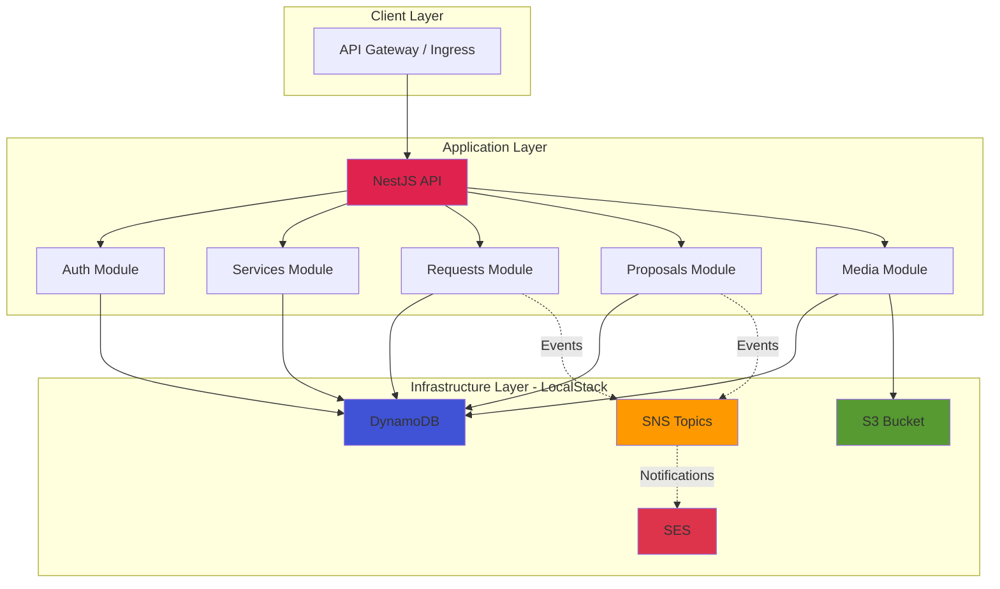

<div align="center">

# 🛍️ Service Marketplace API

### *Plataforma completa e escalável para conectar clientes e prestadores de serviços*

[](https://nestjs.com/)
[](https://www.typescriptlang.org/)
[](https://aws.amazon.com/)
[](https://aws.amazon.com/dynamodb/)
[](https://aws.amazon.com/s3/)
[](https://www.docker.com/)
[](https://kubernetes.io/)
[](https://www.terraform.io/)


</div>

---

## 📋 Sobre o Projeto

**Service Marketplace** é uma API REST production-ready que simula um marketplace completo de serviços, onde **clientes** criam solicitações e **prestadores** enviam propostas competitivas. O projeto demonstra práticas avançadas de arquitetura de software, integrando serviços AWS locais (via LocalStack) e preparado para deploy em Kubernetes.

### ✨ Destaques

- 🏗️ **Clean Architecture** com separação clara de camadas (Domain, Application, Infrastructure, Presentation)
- 🎯 **Princípios SOLID** aplicados rigorosamente em todos os módulos
- ☁️ **Infrastructure as Code** com Terraform
- 📦 **Upload de Arquivos** para S3 com Presigned URLs
- 🔔 **Sistema de Notificações** preparado (SNS + SES)
- 🐳 **LocalStack** completo para desenvolvimento local
- ☸️ **Kubernetes-ready** com manifests completos e auto-scaling
- 🚀 **Docker Compose** para setup rápido

---

## 🏛️ Arquitetura

### Stack Tecnológica

<div align="center">

| Backend | Database | Storage | Messaging | DevOps |
|:-------:|:--------:|:-------:|:---------:|:------:|
|  |  |  |  |  |
| NestJS | DynamoDB | Amazon S3 | SNS + SES | Docker |
|  |  |  |  |  |
| TypeScript | LocalStack | Terraform | Kubernetes | Node.js |

</div>

### 🎯 Arquitetura de Serviços



---

## 🧩 Módulos Implementados

### 🔐 **Auth Module** ✅
Autenticação e autorização com JWT
- Login/Register com bcrypt
- Refresh Token
- JWT Strategy com Passport
- Guards para proteção de rotas

### 👥 **Users Module** ✅
Gerenciamento completo de usuários
- Criação de contas (CLIENT/PROVIDER)
- CRUD completo com validação
- Perfis diferenciados por tipo
- Integração com Auth

### 🛠️ **Services Module** ✅
Catálogo de serviços do marketplace
- CRUD completo de serviços
- Categorização e busca
- Serviços ativos/inativos
- Validação de unicidade de nome

### 📝 **Requests Module** ✅
Solicitações de clientes
- Criar e gerenciar solicitações
- Status tracking: `OPEN` → `IN_NEGOTIATION` → `CLOSED` → `CANCELLED`
- Busca por cliente, serviço e status
- Query otimizada via GSI1 e GSI2

### 💼 **Proposals Module** ✅
Propostas de prestadores
- Criar e listar propostas
- Status: `PENDING` → `ACCEPTED` / `REJECTED` / `WITHDRAWN`
- Busca por request e provider
- Relacionamento N:1 com Requests

### 🖼️ **Media Module** ✅
Upload e gerenciamento de arquivos
- Upload para S3 com validação
- Presigned URLs temporárias
- Suporte: Imagens, PDFs, Vídeos, Áudio
- Hash SHA256 e metadata
- Paginação com cursor
- Associação com Requests

### 📧 **Notifications Module** ✅
Sistema de notificações (preparado)
- SNS Topics configurados
- Templates SES para emails
- Eventos: Nova proposta, Request criado
- Pronto para Lambda triggers

---

## 🏗️ Clean Architecture

```
src/
├── modules/
│   ├── auth/                      # ✅ Autenticação JWT
│   │   ├── presentation/          # Controllers, DTOs, Guards
│   │   ├── application/
│   │   │   └── use-cases/         # Login, Register, Refresh
│   │   ├── domain/
│   │   │   ├── entities/          # Token Payload
│   │   │   └── interfaces/        # Token Service
│   │   └── infrastructure/
│   │       ├── strategies/        # JWT Strategy
│   │       └── services/          # Token Service
│   │
│   ├── users/                     # ✅ Gerenciamento de usuários
│   ├── services/                  # ✅ Catálogo de serviços
│   ├── requests/                  # ✅ Solicitações
│   ├── proposals/                 # ✅ Propostas
│   └── media/                     # ✅ Upload de arquivos
│       ├── domain/
│       │   ├── entities/          # Media
│       │   └── interfaces/        # S3 Service, Repository
│       ├── infrastructure/
│       │   ├── services/
│       │   │   ├── s3.service.ts           # ✅ AWS S3
│       │   │   └── validation.service.ts   # ✅ File validation
│       │   └── repositories/
│       └── application/use-cases/
│           ├── upload-media.use-case.ts    # ✅ Upload + Hash
│           ├── list-media.use-case.ts      # ✅ Paginação
│           └── delete-media.use-case.ts    # ✅ Delete S3 + DB
│
├── database/                      # ✅ DynamoDB config
└── shared/                        # Config, Utils

Total: 6 módulos completos, 50+ arquivos
```

### 🎯 Princípios SOLID Aplicados

| Princípio | Aplicação no Projeto |
|-----------|---------------------|
| **S**ingle Responsibility | Cada use-case tem UMA responsabilidade (ex: UploadMediaUseCase) |
| **O**pen/Closed | Novos módulos são extensões, código existente não é modificado |
| **L**iskov Substitution | Repositórios implementam interfaces e são intercambiáveis |
| **I**nterface Segregation | Interfaces específicas (IMediaRepository, IS3Service) |
| **D**ependency Inversion | Dependemos de abstrações (interfaces), não implementações |


---

## 🌟 Funcionalidades Avançadas

- ✅ **Auto-scaling horizontal** no Kubernetes
- ✅ **Health checks** e self-healing
- ✅ **Presigned URLs** para acesso seguro ao S3
- ✅ **Paginação com cursor** (lastKey)
- ✅ **Validação de arquivos** (tipo, tamanho, extensão)
- ✅ **Hash SHA256** para integridade de arquivos
- ✅ **Rollback automático** em falhas de upload
- ✅ **Infrastructure as Code** (Terraform)
- ✅ **Service discovery** no Kubernetes
- ✅ **Load balancing** automático


---

<div align="center">

### Desenvolvido com ❤️ e ☕

**Service Marketplace** - Um projeto completo demonstrando Clean Architecture, AWS Services e Kubernetes

⭐ Se este projeto foi útil, deixe uma estrela!

</div>
